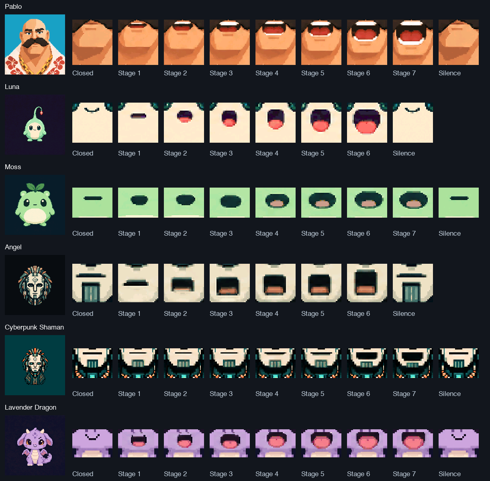
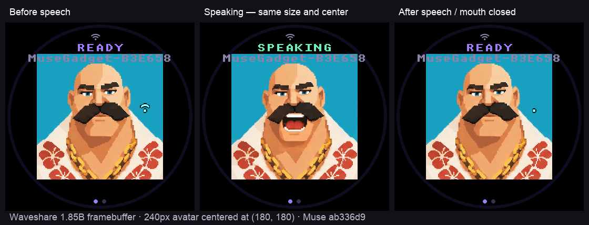

# AI Pets for Muse

Private integration of our `.aipetframes` packages into the
[Muse ESP32 SDK](https://github.com/facebookincubator/muse-gadget-sdk/tree/main/esp32).
Codex's **sprite-aipets** skill remains the authoring workflow. Muse supplies
its device UI and connection; our canonical C player supplies the animated pet.

## Use a pack

Requires Node.js 22+, npm, Python 3, Git, CMake 3.24+, and a C/C++ compiler.
The simulator supports macOS and Linux and fetches pinned LVGL/SDL.
Create and visually review a pet with the installed `sprite-aipets` skill,
then import its delivered pack:

```sh
git clone --recurse-submodules https://github.com/veiovi/aipets-muse.git
cd aipets-muse
npm ci --ignore-scripts
npm run prepare:muse -- /absolute/path/to/pet.aipetframes
npm run build:simulator
AIPET_PACK="$PWD/build/sdk/pet.aipetframes" ./build/simulator/muse_simulator
```

The simulator runs Muse's production UI. Use its
[keyboard controls](https://github.com/facebookincubator/muse-gadget-sdk/blob/693cde9a884ad1edc87251b9f8944815f8de4809/esp32/simulator/README.md) to change states,
audio level and touch/happiness. It is a native desktop preview, not a website.

Preparation validates with the canonical C/WASM player, verifies pinned runtime
sources, and produces an isolated SDK under `build/sdk/` with a SHA-256 receipt.
The upstream submodule stays unchanged. Generated firmware and credentials stay ignored.

## Included characters

The owner-authorized private library contains these unchanged, reviewed packs.
The [catalog](characters/catalog.json) records exact versions, hashes, byte sizes
and source-review hashes. These assets are private; the compiler's MIT license
does not grant permission to redistribute character artwork.

| Character | Version | Mouth stages, including closed |
|---|---|---|
| [Pablo](characters/pablo.aipetframes) | 0.2.1 | 8 |
| [Luna](characters/luna.aipetframes) | 1.3.1 | 7 |
| [Moss](characters/moss.aipetframes) | 1.3.0 | 8 |
| [Angel](characters/angel.aipetframes) | 2.1.0 | 7 |
| [Cyberpunk Shaman](characters/cyberpunk-shaman.aipetframes) | 0.1.0 | 8 |
| [Lavender Dragon](characters/lavender-dragon.aipetframes) | 0.1.0 | 8 |

All six are 240×240 core packs. Select one before building, for example:

```sh
npm run prepare:muse -- characters/pablo.aipetframes
```

This selects the pack for the next build; it does not add an on-device switcher.
Older revisions of the same character are omitted. Pip-Loom's H3 release is
not compatible with this pin: its smallest pack is 3,273,828 bytes, above the
3,000,000-byte cap and 3 MiB partition, and needs newer speaking-motion support.

The mouth check below is captured from the actual Muse C renderer. It tests all
101 input levels and verifies distinct pixels inside each character's mouth
region, then restores the exact closed mouth on silence. Source art is unchanged.



## Compatibility

- Complete **120×120 v1 and 240×240 v2** core packs, up to **3,000,000 bytes**
  (v1 retains its smaller canonical format limit). Zlib resources, speech poses,
  layered effects, idle motion and touch use the existing player unchanged.
- Compatible core packs from `fal-h3-aipet` use the same file contract; its
  authoring tools are not bundled. Standalone move packs cannot replace a core pet.
- Firmware targets: **Waveshare ESP32-S3-Touch-AMOLED-1.75C** (default, 32 MB flash)
  and **Waveshare ESP32-S3-Touch-LCD-1.85B** (16 MB flash), both with 8 MB PSRAM.
  Other boards need separate memory/layout/build verification.
- Muse's 40 ms refresh feeds fixed 33 ms player ticks. Native pixels are scaled
  into RGB565 strips without a 64×64 intermediate.

## Firmware

With **ESP-IDF 6.0.1** installed and exported, `npm run build:firmware` builds
without opening a device. The pack occupies a separate 3 MiB data partition at
`0x830000`; Muse's original application/settings offsets stay intact. Firmware
checks exact length, SHA-256 and canonical validation. The generated flash target
includes both firmware and matching pack. Upstream OTA is disabled to prevent
it replacing the custom renderer.

For the 1.85B, select the exact board during preparation:

```sh
npm run prepare:muse -- /absolute/path/to/pet.aipetframes --board waveshare-s3-185b
npm run build:firmware
```

Build and `configure:firmware` use the prepared board: `build/firmware-185b/`
for 1.85B, `build/firmware/` for 1.75C. Settings are separate. The 1.85B centers
the pet at 240×240 pixels and keeps that size during spoken replies, with captions
on a dark band below the mouth. Its simulator uses the same 360×360 screen. The 1.85B uses
BOOT for talk/pairing and the touchscreen for settings. PWR remains the physical
power switch; software power-off and battery telemetry are unavailable. This
port requires physical display, touch and audio acceptance before release.

Building is not permission to flash. Migrating an existing AI Pets device to
Muse changes its firmware and partition layout: follow the release workflow,
identify hardware, hold its lease, preserve private settings, and verify an
interaction. Never flash a `.aipetframes` file at address zero.

Pairing needs the user's Muse SDK token and app. Set credentials only in ignored
build configuration through `npm run configure:firmware`; simulator and compile-only
checks need none. Muse currently returns **text replies**; spoken replies need
TTS integration. Actual playback audio levels already drive our mouth stages.

### 1.85B speech bench verification

Pablo has been flashed onto the 1.85B with verified flash readbacks and preserved
Wi-Fi settings. The actual Muse MP3 decoder/playback path produced three distinct
mouth shapes; after playback, the mouth region returned to exactly the same closed
pixels as before speech. The speaker-to-microphone tone sweep also passed on both
microphone channels. An ESP PSRAM alignment issue found on the device is fixed and
covered by a regression test.



These are device framebuffer captures. Physical LCD colors, touch/swipe and BOOT
still need a human check. Account pairing and live conversational TTS remain
unverified; the built-in speech sample needs neither. See the immutable
[centered-layout receipt](docs/device-releases/2026-10-05-185b-centered.json),
[earlier speech bench receipt](docs/device-releases/2026-10-05-185b-muse-bench.json) and
[initial migration receipt](docs/device-releases/2026-10-05-185b-muse-initial.json).

## Verify

```sh
npm test
# Tests create diagnostic packs, not character artwork.
npm run prepare:muse -- build/test-packs/240.aipetframes
npm run build:simulator
AIPET_PACK="$PWD/build/sdk/pet.aipetframes" ctest --test-dir build/simulator --output-on-failure
```

Host tests compare with the canonical C player using ASan/UBSan. CI also builds
and runs Muse's headless simulator checks. Hardware timing, PSRAM headroom,
pairing and live speech require physical acceptance.
See [integration details](docs/README.md).

## Source and service terms

Muse source is Apache-2.0; its default Jollybot artwork is excluded from that
license and is not our avatar. The compiler/runtime archive is the MIT-licensed
`sprite-aipets` distribution; miniz notices remain inside it. See
[compiler license](vendor/LICENSE.frame-pack) and
[Muse license](https://github.com/facebookincubator/muse-gadget-sdk/blob/693cde9a884ad1edc87251b9f8944815f8de4809/LICENSE).

Muse service access separately follows its
[SDK token terms](https://gadgets.muse.ai/sdk-terms), including personal,
non-commercial use and restricted device distribution. A private repository
does not change those service terms.
